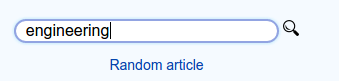

# Wikipedia Viewer

## Description
This application uses the Wikipedia API to make a search request, details on the API can be found [here](https://www.mediawiki.org/wiki/API:Main_page" target="_blank"). The user also has the option of opening a random link to a Wikipedia entry by clicking the link below the search bar.

## Live Demo

https://coymeetsworld.github.io/wikipedia-viewer

  

  

## About

Wikipedia Viewer was written by Coy Sanders as a requirement in the [Intermediate Front-End Development Projects](https://www.freecodecamp.com/challenges/build-a-wikipedia-viewer) for [FreeCodeCamp](https://www.freecodecamp.com) to earn the Front-End Development Certification.

software is licensed under the 

## Other Credits

Search icon found [here](http://www.iconsdb.com/black-icons/search-9-icon.html) and is provided by [icons8](https://icons8.com/) via  Creative Commons Attribution-NoDerivs 3.0.

Copyright (c) 2017 

